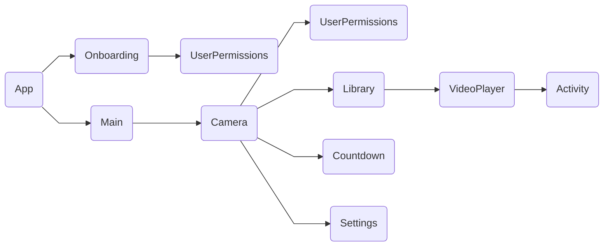
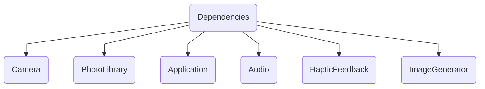

# 📸 SwiftUI Camera App

A SwiftUI-based camera app with video recording, sharing, playback, and deletion functionalities.

## 🚀 Features

- 🎥 **Video Recording**: Record high-quality videos directly within the app.
- 🌐 **Sharing**: Easily share videos to your friends using Apple's built-in Activity feature.
- ▶️ **Playback**: Enjoy a built-in video player to view your recorded content.
- 🗑️ **Deletion**: Manage your video library with the ability to delete unwanted recordings.

## 🛠️ Tech Stack
- **SwiftUI**: For building the user interface
- **AVFoundation**: For camera and video recording functionalities.
- **Swift-Concurrency**: For reactive programming and handling data flow.
- **MVVM**: Application architecture
- **UIKit**: Lightweight integrations with existing UIKit views.

### 🧰 Dependencies
This app was built using various libraries from [PointFree](https://www.pointfree.co/).
- [swift-dependenices](https://github.com/pointfreeco/swift-dependencies): A dependency management library inspired by SwiftUI's "environment."
- [swift-navigation](https://github.com/pointfreeco/swift-navigation): Bringing simple and powerful navigation tools to all Swift platforms, inspired by SwiftUI.
- [swift-sharing](https://github.com/pointfreeco/swift-sharing): Instantly share state among your app's features and external persistence layers, including user defaults, the file system, and more.

## 🏠 Architecture

The app follows an MVVM architecture.

### Features

Features are organized as a tree - where each major view is powered by a model.

### Dependencies

Dependenices are global, self-contained, and non-heirarchical.

